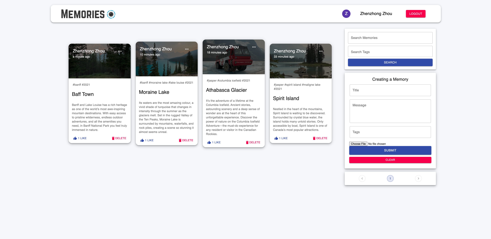

# Memory_Project

Using React, Node.js, Express & MongoDB build a Full Stack MERN Application. The App is called Memories,
and it is a simple social media app that allows users to post interesting events that happened in their lives.
Client side / Frontend:
- netlify: https://timeline-memories.netlify.app
- cd client
- npm ci / npm install
- npm start 

Server side / Backend:
- heroku: https://memory-timeline-project.herokuapp.com
- under root directory
- npm ci / npm install
- npm run devStart